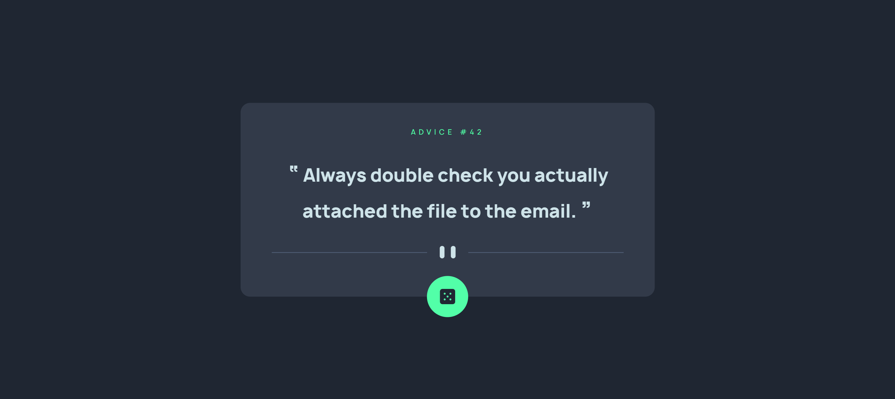
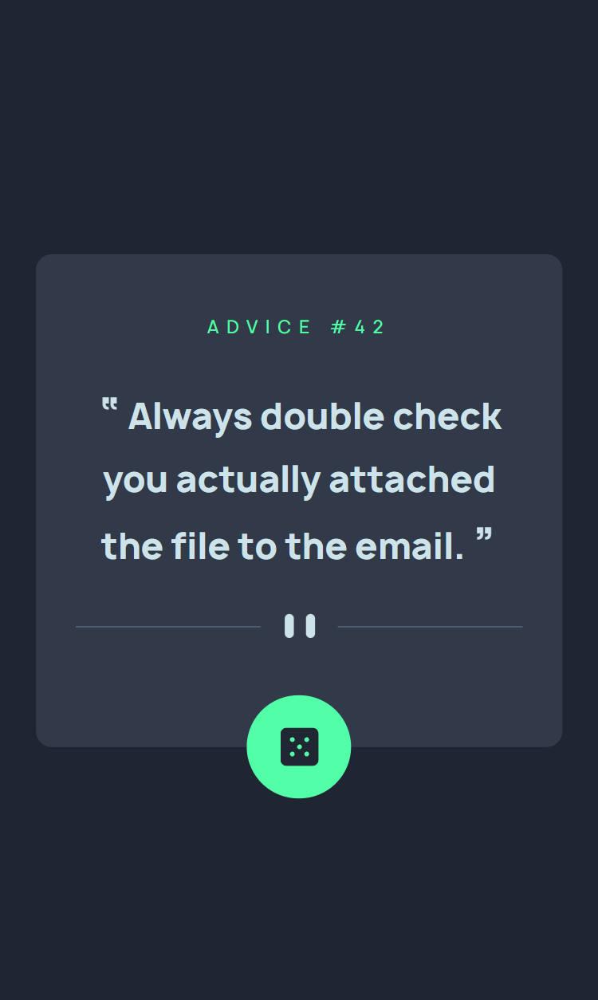

# Advice Generator Web App
This web app provides users with an endless stream of advice to help them navigate life's challenges. Built with HTML, CSS, and JavaScript, our app is responsive and accessible on any device.

## Usage
To use the app, simply click the "Dice" button to generate a new piece of advice from the Advice Slip API. The advice is displayed on the screen in a large font that is easy to read.

You can click the button as many times as you like to receive a continuous stream of advice. You can also scroll through the app's history to review past pieces of advice.

## Screenshots

## Installation
To install the app, simply download the source code and open the index.html file in your web browser. Alternatively, you can visit the live demo at [insert live demo link here].

## Credits
This app was built using the Advice Slip API.

## License
This app is licensed under the [insert license type here] license. See the LICENSE file for details.